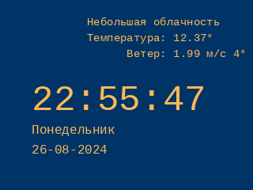
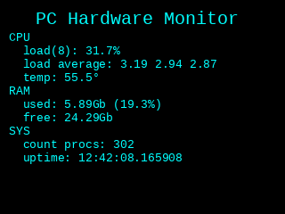
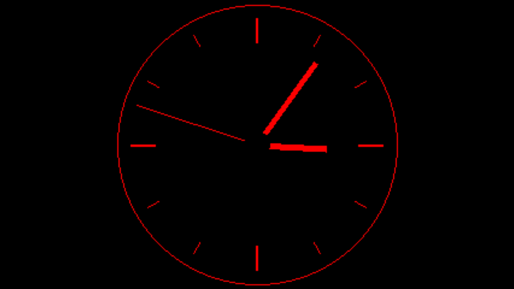

# Logitech G19s Linux support

A set of scripts for working with the Logitech G19s keyboard

## What you need to use this

| Component  | Version |
|---|---|
| Python | 3.11|
| pyusb | 1.2.1 |
| psutil | 6.0.0 |
| pillow | 10.4.0 |

pip requirements.txt included

## What is here

At the moment, a class for working with the keyboard display has been implemented in the file (display_g19s.py)
Applets have been prepared that display images on the screen:

Time (show_time_image.png)

Time and Weather (show_time_image_with_weather.png)

System monitor (show_hw_monitor_image.png)

Analog clock (clock.gif)

A Menu class has been implemented for working with display keys.
At the moment, it is possible to switch applets by pressing the right and left arrows.

## API

For the thecatsapi and weather APIs, it is necessary to obtain tokens, they must be registered in the following files:

./tokens/thecatsapi
./tokens/openweathermap

## Display Buttons

Display button press identifiers:

| ID  | Button |
|---|---|
| 1 | gear / settings |
| 2 | back |
| 4 | menu |
| 8 | ok |
| 16 | right arrow |
| 32 | left arrow |
| 64 | down arrow |
| 128 | up arrow |

To run the current implementation of the project, you need to run main.py with root rights.
