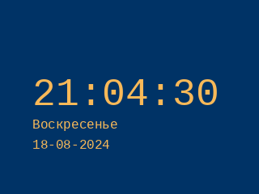

# Logitech G19s Linux support

A set of scripts for working with the Logitech G19s keyboard

## What you need to use this

Python 3.11
pyusb 1.2.1
psutil 6.0.0

## What is here

At the moment, a class for working with the keyboard display has been implemented in the file (display_g19s.py)
Functions have been prepared that generate images with time (show_time_image.png) and the system monitor (show_hw_monitor_image.png)
isr4300-universalk9.17.09.05a.SPA.bin

