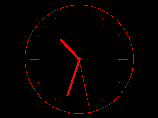

# Logitech G19s Linux support

A set of scripts for the G19 and G19s keyboards. Includes an installer that installs into the operating system. Installation requires an Internet connection to download the necessary packages into the virtual environment. The installation must be launched with root rights. Tested on Debian 12.

Planned revision:
Moving applets to separate classes.
Creating new applets for the display.
Creating a menu applet for control from the display buttons.
Saving settings to the configuration.

## What you need to use this

| Component  | Version |
|---|---|
| Python | 3.11|
| pyusb | 1.2.1 |
| psutil | 6.0.0 |
| pillow | 10.4.0 |

pip requirements.txt included

## What is here

At the moment, a class for working with the keyboard display has been implemented in the file (display_g19s.py)
Applets have been prepared that display images on the screen:

Time (show_time_image.png)

Displays the current time, CPU and memory load. Filling of mountpoints of individual partitions in the system (the animation shows the mounting of the drive and writing data to it, unmounting). Speed ​​increased.

System monitor (show_hw_monitor_image.png)

Analog clock (clock.gif)

Speed ​​increased.

A Menu class has been implemented for working with display keys.
At the moment, it is possible to switch applets by pressing the right and left arrows.
When launched, the keyboard backlight turns on and the colors change smoothly.

## API

For the thecatsapi and weather APIs, it is necessary to obtain tokens, they must be registered in the following files:

./tokens/thecatsapi
./tokens/openweathermap

## Display Buttons

Display button press identifiers:

| ID  | Button |
|---|---|
| [1, 128] | gear / settings |
| [2, 128] | back |
| [4, 128] | menu |
| [8, 128] | ok |
| [16, 128] | right arrow |
| [32, 128] | left arrow |
| [64, 128] | down arrow |
| [128, 128] | up arrow |
| [0, 128] | any button released |

To run the current implementation of the project, you need to run main.py with root rights.

## M keys and G keys

| Button | buffer |
|---|---|
|G1 ||
| button pressed | [2, 1, 0, 64], [3, 0, 0, 0, 0, 0, 0, 2, 1, 0, 64] |
| button released | [3, 58, 0, 0, 0, 0, 0, 2, 0, 0, 64] |
| G2 ||
| button pressed | [2, 2, 0, 64], [3, 0, 0, 0, 0, 0, 0, 2, 2, 0, 64] |
| button released | [3, 59, 0, 0, 0, 0, 0, 2, 0, 0, 64] |
| G3 ||
| button pressed | [2, 4, 0, 64], [3, 0, 0, 0, 0, 0, 0, 2, 4, 0, 64] |
| button released | [3, 60, 0, 0, 0, 0, 0, 2, 0, 0, 64] |
| G4 ||
| button pressed | [2, 8, 0, 64], [3, 0, 0, 0, 0, 0, 0, 2, 8, 0, 64] |
| button released | [3, 61, 0, 0, 0, 0, 0, 2, 0, 0, 64] |
| G5 ||
| button pressed | [2, 16, 0, 64], [3, 0, 0, 0, 0, 0, 0, 2, 16, 0, 64] |
| button released | [3, 62, 0, 0, 0, 0, 0, 2, 0, 0, 64] |
| G6 ||
| button pressed | [2, 32, 0, 64], [3, 0, 0, 0, 0, 0, 0, 2, 32, 0, 64] |
| button released | [3, 63, 0, 0, 0, 0, 0, 2, 0, 0, 64] |
| G7 ||
| button pressed | [2, 64, 0, 64], [3, 0, 0, 0, 0, 0, 0, 2, 64, 0, 64] |
| button released | [3, 64, 0, 0, 0, 0, 0, 2, 0, 0, 64] |
| G8 ||
| button pressed | [2, 128, 0, 64], [3, 0, 0, 0, 0, 0, 0, 2, 128, 0, 64] |
| button released | [3, 65, 0, 0, 0, 0, 0, 2, 0, 0, 64] |
| G9 ||
| button pressed | [2, 0, 1, 64], [3, 0, 0, 0, 0, 0, 0, 2, 0, 1, 64] |
| button released | [3, 66, 0, 0, 0, 0, 0, 2, 0, 0, 64] |
| G10 ||
| button pressed | [2, 0, 2, 64], [3, 0, 0, 0, 0, 0, 0, 2, 0, 2, 64] |
| button released | [3, 67, 0, 0, 0, 0, 0, 2, 0, 0, 64] |
| G11 ||
| button pressed | [2, 0, 4, 64], [3, 0, 0, 0, 0, 0, 0, 2, 0, 4, 64] |
| button released | [3, 68, 0, 0, 0, 0, 0, 2, 0, 0, 64] |
| G12 ||
| button pressed | [2, 0, 8, 64], [3, 0, 0, 0, 0, 0, 0, 2, 0, 8, 64] |
| button released | [3, 69, 0, 0, 0, 0, 0, 2, 0, 0, 64] |
| M1 ||
| button pressed | [2, 0, 16, 64] |
| button released | [2, 0, 0, 64] |
| M2 ||
| button pressed | [2, 0, 32, 64] |
| button released | [2, 0, 0, 64] |
| M3 ||
| button pressed | [2, 0, 64, 64] |
| button released | [2, 0, 0, 64] |
| MR ||
| button pressed | [2, 0, 128, 64]|
| button released | [2, 0, 0, 64]|
